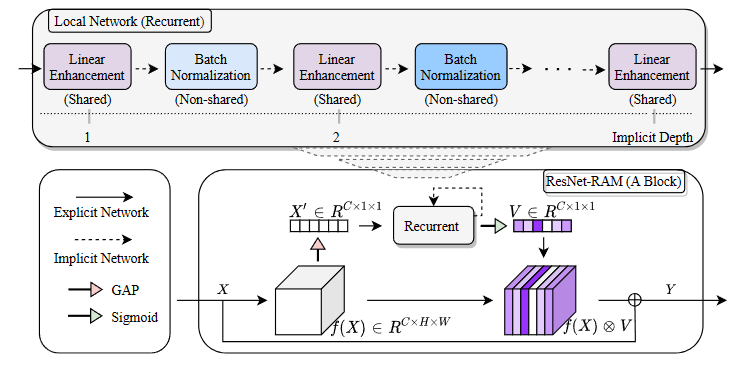

# RAM: Efficient Recurrent Attention Module for Image Recognition

This repository is the implementation of "RAM: Efficient Recurrent Attention Module for Image Recognition" on CIFAR-100, CIFAR-10, and STL10 datasets. 

## Introduction

Both expanding the model depth of deep convolutional neural networks (CNNs) and integrating the attention mechanism into them have shown significant promise for improving image recognition performance. Nevertheless, increasing model depth inevitably escalates both model parameters and computational cost, potentially posing challenges in real-world applications. Similarly, the pursuit of more intricate attention modules like those in existing research for performance improvement also leads to increased computational overhead. To capitalize on the benefits of deeper neural networks and attention mechanisms while minimizing additional parameters for efficient image recognition, we introduce an effective solution named Recurrent Attention Module (RAM). RAM facilitates the augmentation of CNN-based image recognition networks by incorporating lightweight, recurrent attention modules designed for channels. Specifically, we amplify the depth of channel attention modules by applying a lightweight excitation module with recurrent parameter sharing. Through comprehensive experimentation on widely used image recognition datasets, our proposed RAM demonstrates heightened network accuracy. Remarkably, it outperforms existing classical yet state-of-the-art attention modules with only marginal increments in parameters and computational costs.   

<p align="center">
  
</p>


## Requirement
Python and [PyTorch](http://pytorch.org/).
```
pip install -r requirements.txt
```


## Usage

### Train

```sh
# run ResNet164-RAM on cifar100, 1 GPU
CUDA_VISIBLE_DEVICES=0 python run.py --arch ram --dataset cifar100 --block-name bottleneck --depth 164 --epochs 164 --schedule 81 122 --gamma 0.1 --wd 1e-4 --info depth164
```

### Test

```sh
CUDA_VISIBLE_DEVICES=1 python run.py --arch ram --dataset cifar100 --block-name bottleneck --depth 164 --resume checkpoints/cifar100/ram/depth164/model_best.pth.tar --e
```

## Results
| Dataset | ResNet164   |  ResNet164-RAM   |
|:------:|:--------:|:------:|
|CIFAR10 |   93.45 ± 0.20 | 94.84 ± 0.14 |
|CIFAR100|   74.40 ± 0.34 | 76.74 ± 0.24 |
|STL10   |   83.78 ± 1.25 | 86.15 ± 0.81 |


## Acknowledgments
Many thanks to [bearpaw](https://github.com/bearpaw) for his simple and clean [Pytorch framework](https://github.com/bearpaw/pytorch-classification) for image classification task.
